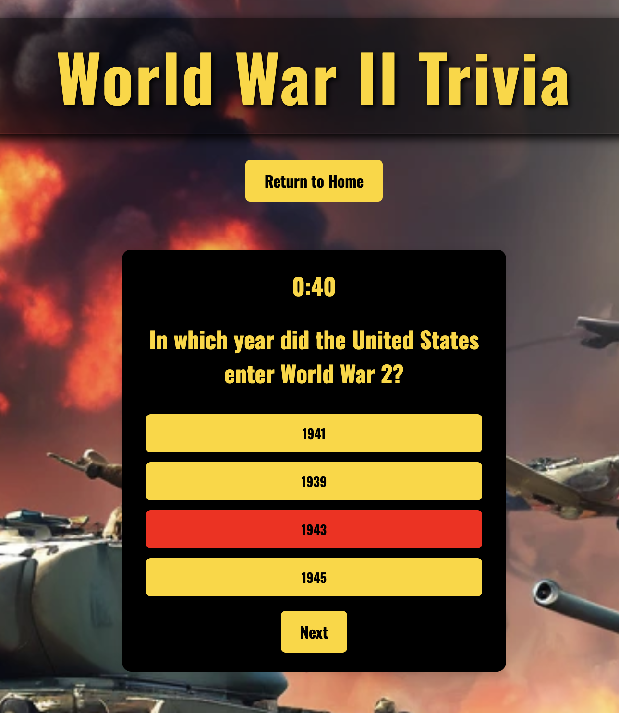
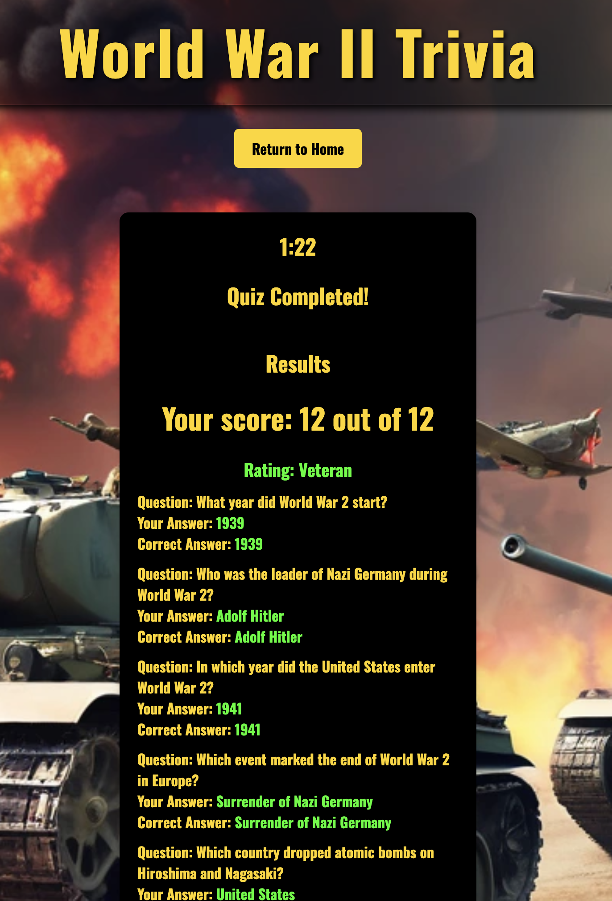
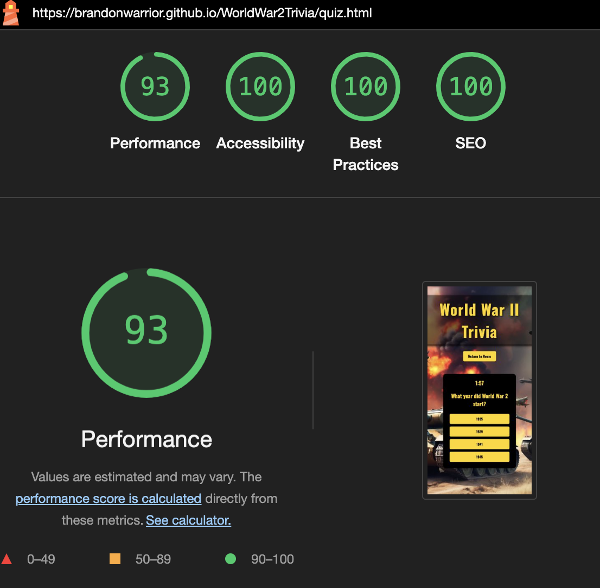
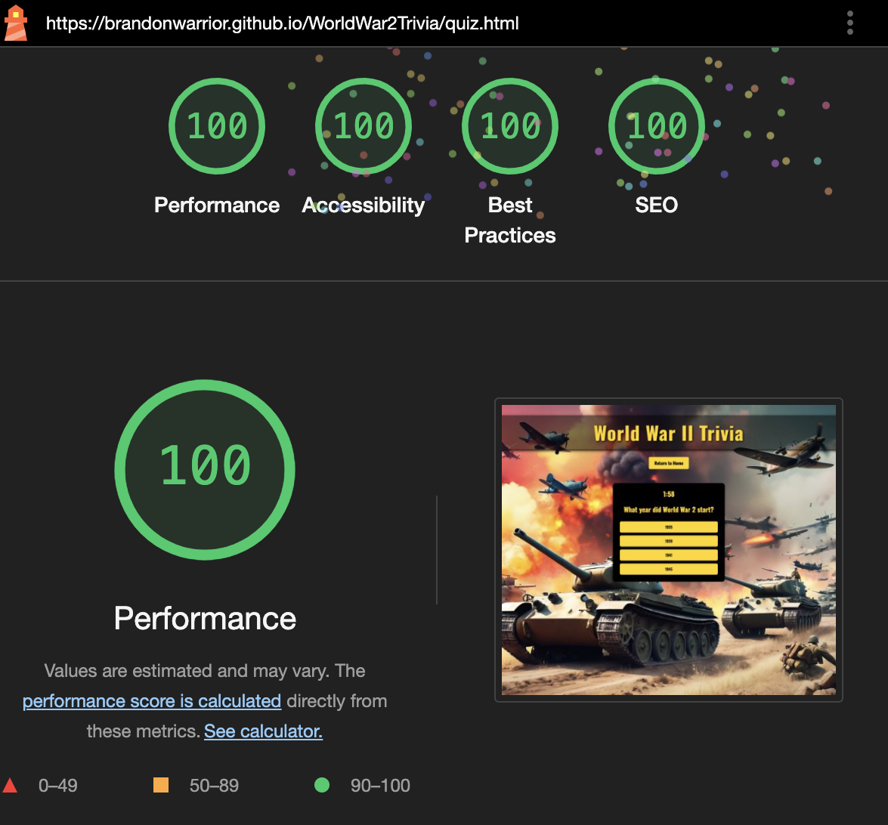

# Welcome to: World War II Trivia 

Welcome to the World War 2 Trivia Quiz project! This interactive quiz is designed to test your knowledge about various aspects of World War 2 history. From key events and battles to influential figures and significant dates, challenge yourself with a series of questions and see how well you know this pivotal period in global history. My fascination with World War 2 has inspired me to create this quiz, as I find the complexities and stories of this era both compelling and crucial for understanding our past. Dive in and test your knowledge of a time that shaped the modern world.

## Planned Features:
- Multiple Choice Questions: Answer a variety of questions related to World War 2.

- Timer: Each question is timed to add an element of challenge.

- Detailed Feedback: After completing the quiz, receive detailed feedback on your answers.

- How to Play Page: Provides instructions on how to navigate and play the quiz, ensuring users understand the game mechanics.

## Technologies used:
- HTML, CSS: For structuring and styling the quiz interface.

- JavaScript: To handle quiz logic, including question generation and answers.

- Responsive Design: Ensures the quiz adapts well to various screen sizes, from desktops, tablets and mobile phones.

## Color Scheme

### Primary Colors
- Gold (#FFD700): This color is used for text and buttons, providing a sharp contrast against darker backgrounds. It symbolizes value and significance, drawing attention to key elements and interactive features.

- Black (#000000): The black background for the header text and other elements provides a strong foundation for the visual hierarchy. Additionally, the container and footer are also black to ensure there is no difficulty with contrast and readability, maintaining a cohesive and visually clear design throughout the application. This consistent use of black enhances the overall user experience by offering a stark and effective contrast to other colors used in the project.

### Secondary Colors 

- Red (#FF0000): Employed for alert messages and feedback, red commands attention and signals importance or urgency, making it perfect for providing immediate feedback to users. Also to avoid any contrast erros I made any font that was red bold to avoid readbility issues.

- Green (#00FF00): This bright green color is used for correct answers and rating, symbolizing success and positive feedback. It provides a clear visual cue that the user has selected the right answer or achieved a good rating.

## Features and Pages 

## Font
- The font family used is "Oswald," a sans-serif typeface that is both modern and legible, adding to the overall clarity and usability of the quiz interface.

## Index page

### Header 
- The header includes the title of the quiz in large, eye-catching text. The title is styled with a font and color scheme that aligns with the World War 2 theme.

### Form 
- Below the header, there is a form where users can enter their username. This form is straightforward and inviting, ensuring users can quickly get started with the quiz. However, trying to start the quiz without entering a username will result in an alerts message appearing telling the user they cannot start the quiz without entering a username. 

### "How to Play" Button
 A prominently displayed button labeled "How to Play" directs users to another page with detailed instructions on how to participate in the quiz. This ensures that users understand the rules and mechanics before they begin.

 

### Footer
 The footer is consistently styled with the rest of the page and includes a copyright message along with an additional link inviting you to connect with me on Linkedin. It remains at the bottom of the page, ensuring a clean and structured layout.

### Background Image 
- The entire page features a background image that is relevant to World War 2. This image is set to cover the entire screen, providing a consistent and immersive experience as users navigate through the quiz. The background is fixed and does not zoom or change size when users interact with different elements on the page.

## Quiz
- The quiz page is the core component of the World War 2 Trivia Quiz application, where users actively participate by answering questions. The page is designed to be interactive and user-friendly, providing an engaging experience while testing users' knowledge of World War 2 history.

- Immediate feedback is provided for each answer. Correct answers are highlighted in green (#00FF00), and incorrect answers are highlighted in red (#FF0000). This immediate feedback helps users learn and understand the correct information.

 

## Timer 
- Users have a total of 2 minutes to answer all 12 questions. The timer is clearly visible and counts down, encouraging users to think quickly. If usersdo not complete the quiz within the 2-minute time limit an Out of Time Alert will inform them that they are out of time. The quiz will then show the results based on the questions answered up to that point.

## Results
- At the end of the quiz, users are presented with their final score. The results page provides detailed feedback on each question, showing which answers were correct and which were incorrect. This comprehensive feedback helps users understand their strengths and areas for improvement. Additionally, users receive a rating based on their performance, which categorizes their knowledge level, adding an extra layer of motivation and engagement.

## Code Structure
- The World War 2 Trivia Quiz project is organized into three HTML pages (index.html, quiz.html, and how-to-play.html) to manage the home page, quiz interface, and how to play. It employs two CSS files (styles.css for overall styling and quiz.css for quiz-specific styles) and two JavaScript files (script.js for home page interactions and quiz.js for quiz logic). The docs/images folder stores documentation images, while the assets folder contains subfolders for images, CSS, and JavaScript files, ensuring the project's structure is clean and maintainable.

## Testing and Validation

### Wave Extention
-  used the WAVE (Web Accessibility Evaluation Tool) extension to test my World War 2 Trivia Quiz project to ensure it meets accessibility standards and provides a better user experience for all users, including those with disabilities. WAVE helped identify and fix structural and semantic issues in the HTML, improve color contrast for readability, and ensure proper navigation. By using WAVE iteratively throughout the development process, I was able to address accessibility issues and enhance the overall inclusivity and usability of the website.

### HTML Validation
- All 3 HTML files were validated using the W3C Markup Validation Service. This tool checked for syntax errors and ensured that the HTML markup adhered to current web standards.

### CSS Validation
- Both of my CSS files was validated using the W3C CSS Validator. This process confirmed that all CSS stylesheets are free of errors and follow standard CSS practices.

### JavaScript Validation
- Both JavaScript files was validated using JSHint. This tool reviewed the JavaScript files for potential errors and adherence to best practices, ensuring that the quiz logic runs smoothly and efficiently without any bugs.

## Lighthouse
- The World War 2 Trivia Quiz project was thoroughly tested using Google's Lighthouse tool to ensure optimal performance, accessibility, best practices, and SEO across both mobile and desktop platforms. The scores were consistently high, ranging between 90 and 100. Impressively, the desktop version of the site achieved a perfect score of 100/100 in several categories

## Other Methods of Testing
- In addition to automated testing tools, I conducted manual testing on various devices and browsers to ensure responsiveness and functionality. I also asked friends to test the app, providing valuable feedback on user experience and identifying any issues. Their perspectives helped refine the quiz interface and ensure a smooth, engaging experience for all users. This combination of automated and real-world testing was crucial in delivering a reliable application.

## Bugs and Fixes

### Bug 1 
- Porblem with the timer not resetting when the 'Restart Quiz' Button was clicked.  
### Fix
- Instead of making 2 different functions for startTimer and ResetTimer. i merged them togther to make resetAndStartTimer function. It ensures that the timer starts fresh with the specified duration, updates the timer display regularly, and triggers actions when the time runs out, such as showing an alert and displaying the quiz results.

### Bug 2
-  Problem when multiple clicks to a single answer question contirbuting to the overall score. Example: 20/12. 
### Fix
- Made the corect answer buttons unclickable once clicked for subsequent clicks. 
### Bug 3
- Code changes not applying to runnable python3 -m http.server. 
### Fix
- Deleting browser history, coockies and clearing cached images and files solved the problem and code update and changes were applied.
### Bug 4
- Google Font not applying to buttons throughout the quiz. 
### Fix
- applied the font stlying to buttons in css showed the font on my buttons throughout the quiz. 

## Unfixed bugs
- There are currently no unfixed bugs in this project. 

## Deployment
I deployed the page to GitHub Pages using the following steps:

- Navigate to the project's repository and click on the Settings tab.

- Select the Pages option from the menu on the left.

- In the Source section, choose the Main branch from the drop-down menu and click Save.

- A confirmation message will appear, indicating a successful deployment to GitHub Pages and providing the live URL.

- You can find the live site via the following URL: https://brandonwarrior.github.io/WorldWar2Trivia/index.html

## Future Developments 
- In future updates to the World War 2 Trivia Quiz project, I plan to add several new features. One major improvement will be using local storage to save user scores, so players can keep track of their progress over time. I also aim to connect the app to a database, which will let me store and retrieve scores and user information for a more personalized experience and competitive leaderboards. Other ideas include adding more questions to make the quiz longer, incorporating multimedia elements to make the quiz more engaging, and providing extra historical details to help users learn more about World War 2.

## Credits:
- background image - I created the background image using a AI image generator https://www.canva.com/design/DAGKxMr4i6w/K6HHEQgduea1uBTfz6EkOQ/edit?ui=eyJFIjp7IkE_IjoiViIsIkIiOiJCIn0sIkciOnsiQiI6dHJ1ZX19

- The code used for the background image shorthand was taken from the Love Running project.

- Font - Google Fonts 

- To generate the questions I was going to use I used ChatGPT https://openai.com/chatgpt/